# 🗂️ Todo Web App (Flask)

A simple and clean task manager web application built with **Python**, **Flask**, **HTML**, **CSS**, **JavaScript** and **MySQL**.

This app is part of my coding portfolio and demonstrates:
- Backend development with Flask
- User authentication (signup + login)
- CRUD operations for tasks
- Dark mode / light mode UI
- MySQL database integration
- Clean project structure and maintainable code

---

## 🚀 Features

### User Accounts
- Sign up new users  
- Login with existing accounts  
- Passwords securely hashed  
- Strong password check

### 📝 Task Management
- Add new tasks  
- Mark as **done** or **pending**  
- view History time **created** and **completed**
- Delete tasks  
- Trash bin to restore deleted tasks  
- Timestamp for completed and deleted tasks  

### 🌗 Dark Mode Support
- UI automatically switches based on user preference  
- Stored in session  

### 🗄 Database (MySQL)
Tables include:
- `todo_users`
- `todo_tasks`
- `todo_trash`
- `todo_feedback`

---

## 📸 Screenshots
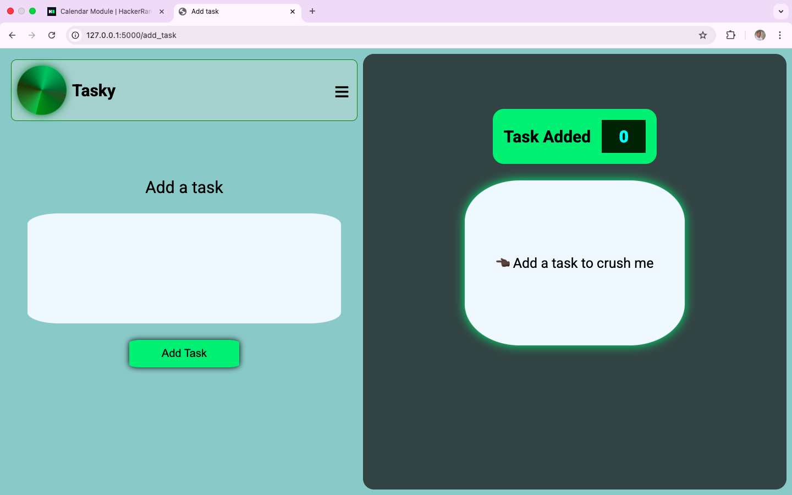
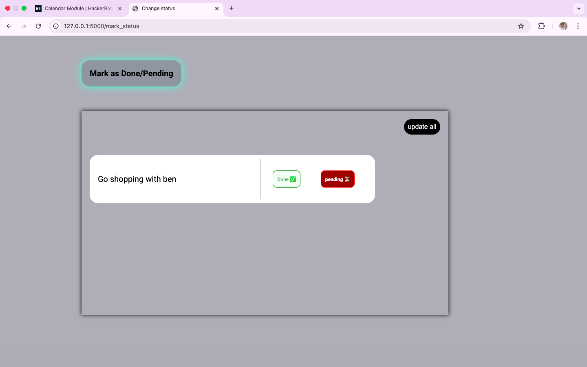
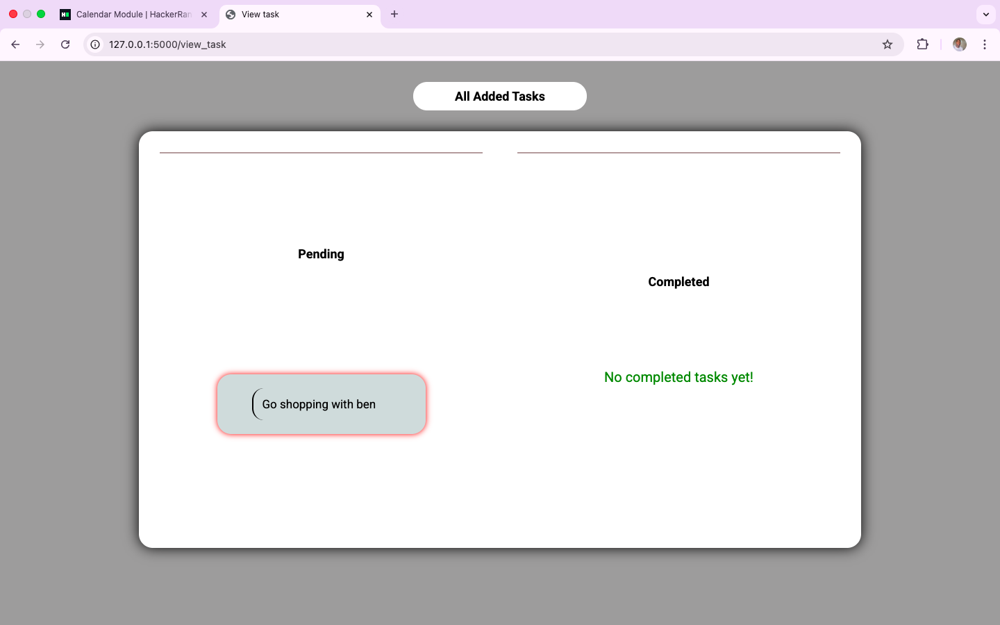
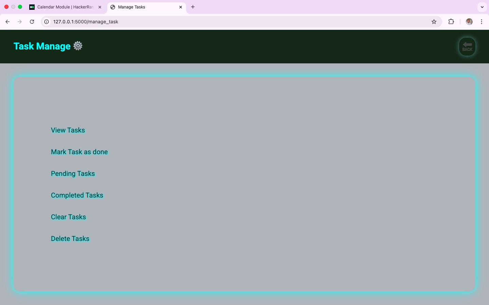
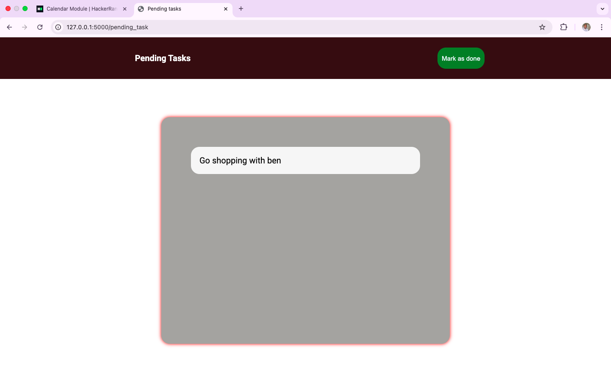
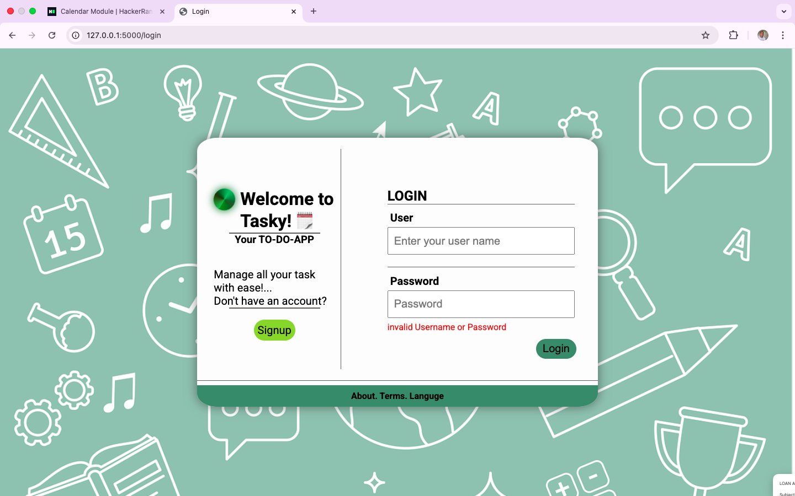
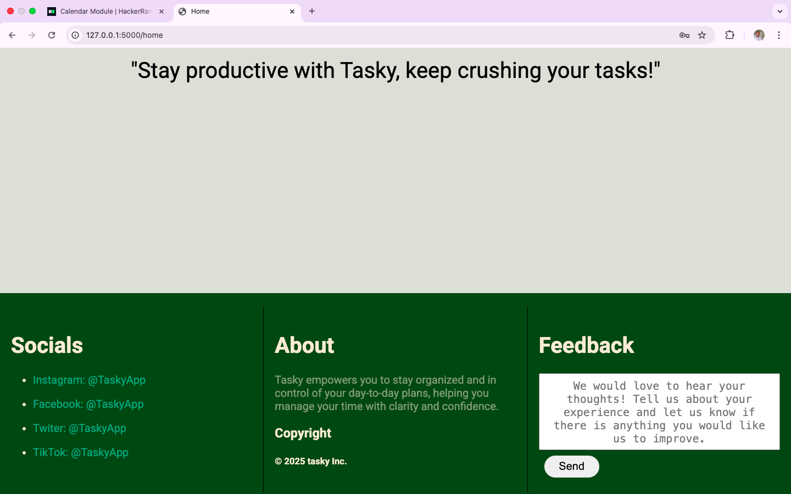
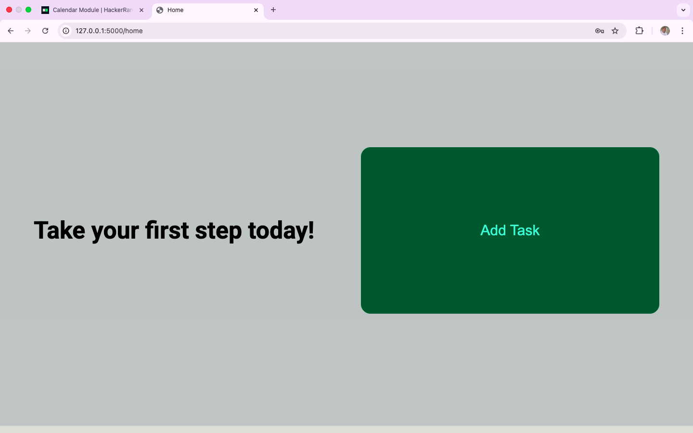
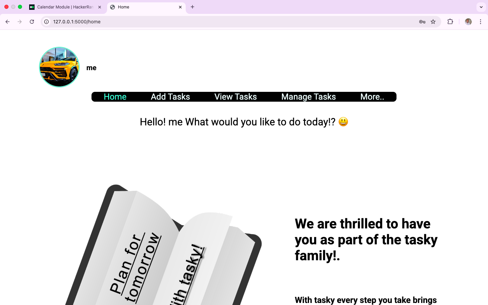
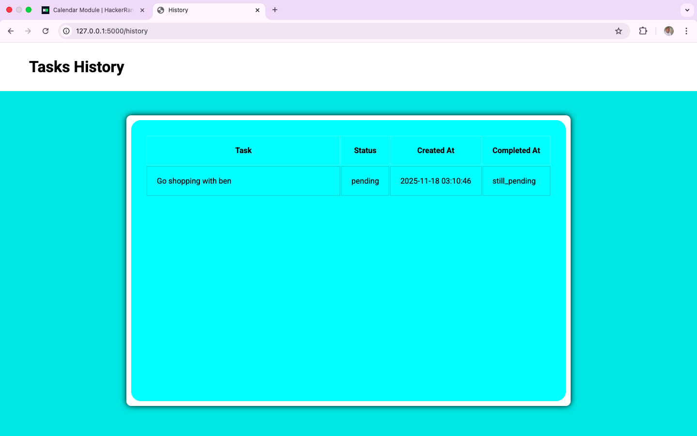
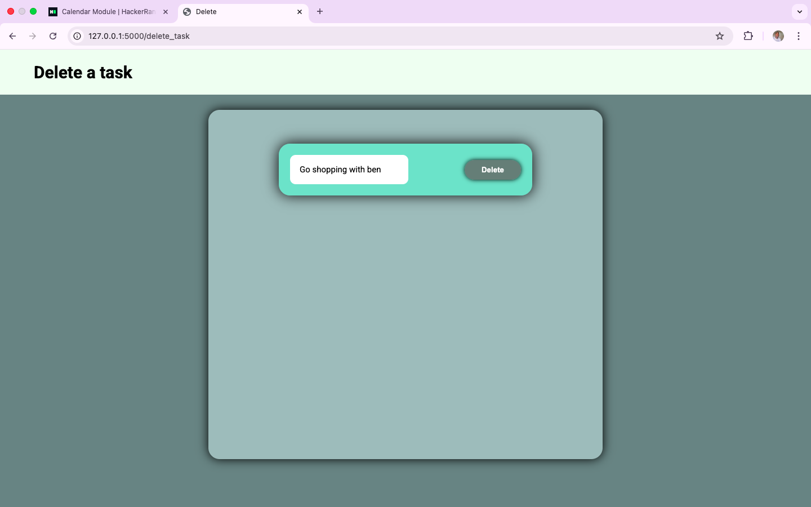
---


### 1. Clone the project
```bash
git clone https://github.com/yourusername/todo_web_app.git
cd todo_web_app
